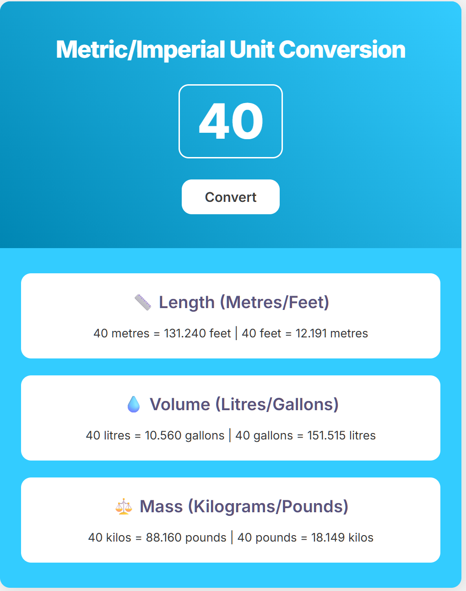

# Metric/Imperial Unit Converter

A simple and responsive web application for converting units between the metric and imperial systems. This project was built to demonstrate core front-end web development skills, including HTML, CSS, modern JavaScript, and automated testing with Jest.



---

## Features

-   **Responsive Design**: The layout adapts to different screen sizes, from mobile phones to desktops.
-   **Live Conversion**: Instantly converts values for length, volume, and mass.
-   **Interactive UI**: Clean and modern user interface with hover effects and subtle animations.
-   **Tested Code**: The conversion logic is validated by a suite of unit and integration tests using Jest.
-   **Formatted Code**: Codebase is kept clean and consistent with Prettier.

### Conversions Supported

-   **Length**: Meters to Feet & Feet to Meters
-   **Volume**: Liters to Gallons & Gallons to Liters
-   **Mass**: Kilograms to Pounds & Pounds to Kilograms

---

## Tech Stack

-   **HTML5**
-   **CSS3**
-   **JavaScript (ES6+)**
-   **Jest**: For automated testing.
-   **Prettier**: For code formatting.

---

## Getting Started

Follow these instructions to get a copy of the project up and running on your local machine for development and testing purposes.

### Prerequisites

You need to have [Node.js](https://nodejs.org/) and [npm](https://www.npmjs.com/) installed on your machine.

### Installation

1.  Clone the repository to your local machine:
    ```sh
    git clone <repository-url>
    ```
2.  Navigate into the project directory:
    ```sh
    cd unitConverterTwo
    ```
3.  Install the necessary dependencies (like Jest and Prettier):
    ```sh
    npm install
    ```

---

## Usage

After installation, you can use the following npm scripts to work with the project.

### Running the Application

To view the application, simply open the `index.html` file in your web browser.

### Running Tests

To run the automated tests and ensure the conversion logic is working correctly, run the following command in your terminal:

```sh
npm test
```

This will execute all unit and integration tests located in the `index.test.js` file.

### Formatting Code

To automatically format all HTML, CSS, and JavaScript files according to the Prettier configuration, run:

```sh
npm run format
```
